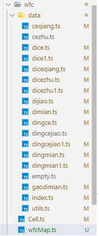

# WFC

## code struct



### how to use:
```js
    /**
     * WCFMap
     * @param size {Vector3} x is width,z:depth,y:height
     */
     const wfcMap = new WFCMap(new Vector3(5, 3, 5));
    
    /**
     *  
     * @param startPos {Vector3} Collopsed form startPos
     */
     WFCMap: Collapse(startPos: Vector3)
```

### base module struct
```js
 interface module {
    name: 'ceqiang', 
    rotation: 0,
    enableVRotation: true,
    probability: 1,
    sockets: {
        pX: '-1',
        nX: '-1',
        pY: 'v8_0',
        nY: 'v8_0',
        pZ: '8f',
        nZ: '8'
    },
    neighbour: {
        pX: [],
        nX: [],
        pY: [],
        nY: [],
        pZ: [],
        nZ: []
    }
}

```

## how to run
wfc directory is independent project,
```shell
    cd wfc
    # install all package
    npm i   
    # run project
    npm run dev
```

## next step 
    1. dae file convet to glb
    2. refine module 
    3. adaptation metaverse\metaverse-utils code struct